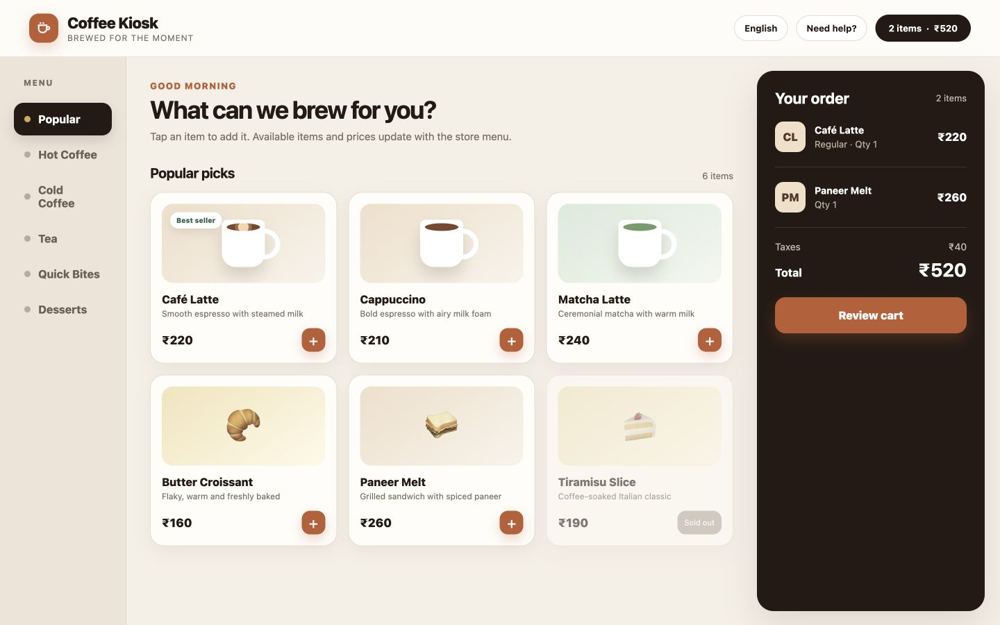
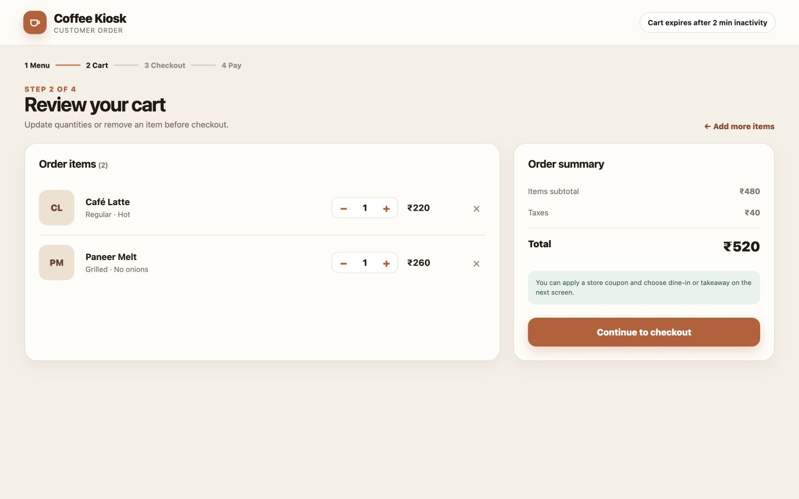
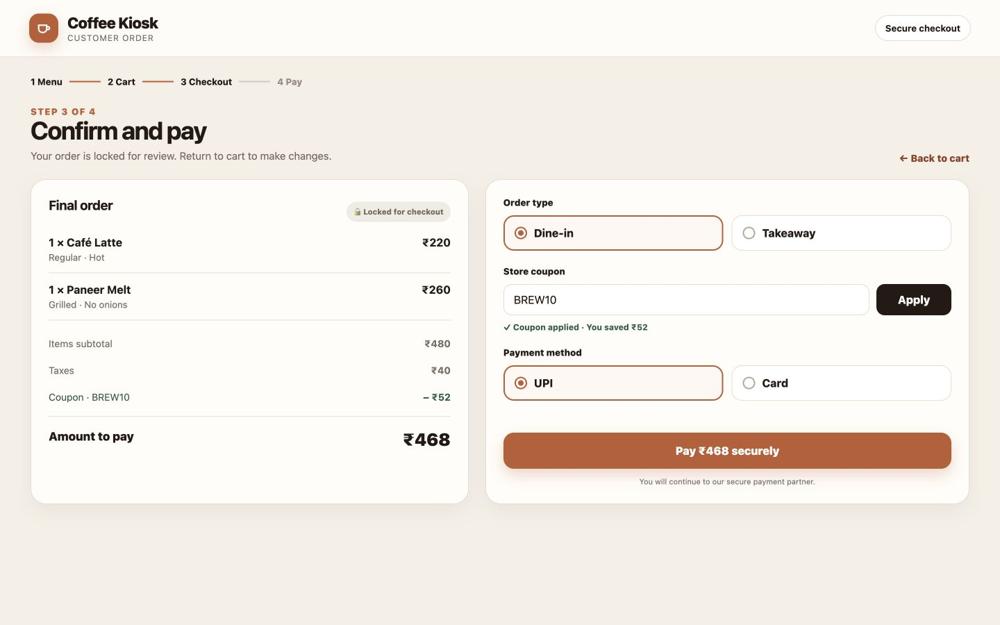
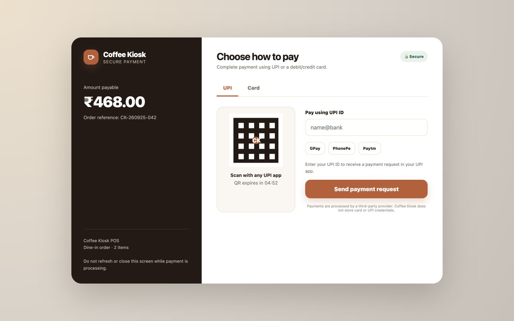
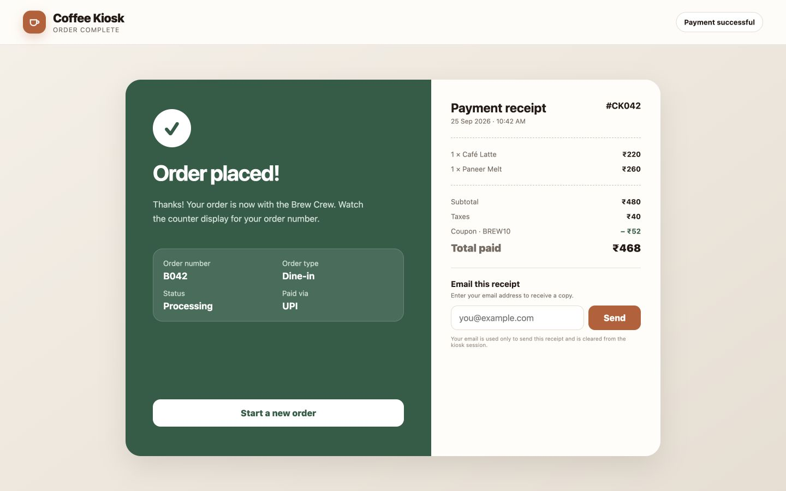

# Coffee Kiosk POS - Customer Frontend

## Functional Requirements Specification

| Document field | Value |
|---|---|
| Project | Coffee Kiosk POS |
| Module | Customer - Frontend |
| Document type | Functional Requirements Specification (FRS) |
| Author | Kushagra Sinha |
| Version | 1.0 |
| Date | 10 September 2026 |
| Status | Draft for review |

## Table of Contents

- [1. Version History](#1-version-history)
- [2. Introduction](#2-introduction)
  - [2.1 Purpose of Document](#21-purpose-of-document)
  - [2.2 Project Scope](#22-project-scope)
  - [2.3 Definitions and Abbreviations](#23-definitions-and-abbreviations)
  - [2.4 System Overview](#24-system-overview)
  - [2.5 Customer Order Flow](#25-customer-order-flow)
- [3. User Personas, Roles, and Permissions](#3-user-personas-roles-and-permissions)
- [4. Functional Requirements](#4-functional-requirements)
  - [4.1 Requirement Priority](#41-requirement-priority)
  - [4.2 Food Catalog](#42-feature---food-catalog)
  - [4.3 Cart](#43-feature---cart)
  - [4.4 Checkout](#44-feature---checkout)
  - [4.5 Payment Gateway](#45-feature---payment-gateway-upi-and-card)
  - [4.6 Order Confirmation and Receipt](#46-feature---order-confirmation-and-receipt)
- [5. Business Rules and Assumptions](#5-business-rules-and-assumptions)
- [6. Non-Functional Requirements](#6-non-functional-requirements)
  - [6.1 Security and Session Management](#61-security-and-session-management)
  - [6.2 Privacy](#62-privacy)
  - [6.3 Usability and Accessibility](#63-usability-and-accessibility)
  - [6.4 Reliability and Compatibility](#64-reliability-and-compatibility)
- [7. Sign-off](#7-sign-off)

> The interface images in this document are illustrative mockups. The written requirements are the source of truth for future test scenarios, test cases, RTM, execution, and defect reporting.

## 1. Version History

| Version | Date | Description of Changes | Author | Status |
|---|---|---|---|---|
| 1.0 | 25 September 2026 | Initial FRS for the Coffee Kiosk POS customer-facing frontend | Kushagra Sinha | Draft for review |

## 2. Introduction

### 2.1 Purpose of Document

This document defines the customer-facing frontend functionality of Coffee Kiosk POS. It describes the expected behaviour from menu browsing through payment and receipt generation so that later STLC documents can be prepared against stable, testable requirements.

### 2.2 Project Scope

Coffee Kiosk POS is a self-ordering application for retail coffee stores. A customer uses an in-store touchscreen kiosk to:

- Browse the available food and beverage menu.
- Add available items to a cart and review the order.
- Choose dine-in or takeaway.
- Apply a valid store coupon, when available.
- Select UPI or Card as the payment method.
- Complete payment through a third-party payment gateway.
- View a bill receipt and optionally receive it by email.

This FRS covers only the customer-facing frontend. Brew Crew operations, administrative settings, backend service behaviour, database testing, and direct testing of the third-party payment provider are outside its implementation scope. Their customer-visible results and integration points remain in scope.

### 2.3 Definitions and Abbreviations

| Term | Definition |
|---|---|
| AWS | Amazon Web Services; the managed cloud platform used for application data services. |
| Brew Crew | Store employees who manage item availability, coupons, and order fulfilment. |
| Card | Debit or credit card payment handled by the third-party payment gateway. |
| FRS | Functional Requirements Specification. |
| IT Admin | Technical staff responsible for application services and supporting infrastructure. |
| POS | Point of Sale. |
| Session | The temporary customer order state held while one kiosk order is in progress. |
| STLC | Software Testing Life Cycle. |
| UI | User Interface. |
| UPI | Unified Payments Interface. |

### 2.4 System Overview

Coffee Kiosk POS uses a ReactJS customer frontend connected to backend services developed with Spring Boot. The backend provides menu, price, coupon, order, and payment-status data. UPI and Card payments are handled by a third-party payment gateway. Application data is stored using an AWS-managed database service.

The kiosk remains lightweight because the customer device runs the frontend while core processing, data storage, and payment handling are managed by centralized services.

### 2.5 Customer Order Flow

`Food Catalog → Cart → Checkout → Payment Gateway → Order Confirmation and Receipt`

If payment fails or is cancelled, the customer returns to a recoverable payment state without receiving a successful receipt.

## 3. User Personas, Roles, and Permissions

| Role | Purpose | Main permissions | Relevance to this FRS |
|---|---|---|---|
| Customer | Places an order using the self-service kiosk. | Browse available items, add or remove items, change quantities, choose dine-in or takeaway, apply a coupon, select UPI or Card, pay, view the receipt, and request an emailed receipt. | Primary and in scope. |
| Brew Crew | Operates the store and fulfils orders. | Manage item availability and valid coupons; search, filter, and view orders; change order status to Cancelled, Processing, Ready for Takeaway, Ready to Serve, or Completed; unlock a kiosk with a passcode; and manage the kiosk password through protected settings. | Interfaces are out of scope. Customer-visible availability, coupon results, and order status are in scope. |
| IT Admin | Maintains the technical platform. | Manage application services, payment-gateway integration, cloud services, monitoring, and related technical configuration. | Administrative interfaces are out of scope. Service availability and customer-visible integration failures are in scope. |

The customer frontend shall not expose Brew Crew or IT Admin functions without the required protected access.

## 4. Functional Requirements

### 4.1 Requirement Priority

| Priority | Meaning |
|---|---|
| P0 | Essential to complete the customer order or payment flow. |
| P1 | Important for a complete, safe, and usable release. |
| P2 | Useful supporting behaviour that does not block the main flow. |

### 4.2 Feature - Food Catalog

| Requirement ID | Priority | Requirement |
|---|---|---|
| REQ-CAT-01 | P0 | The system shall open the customer session on a menu screen that shows the available item categories. |
| REQ-CAT-02 | P0 | The system shall show each menu item with its name, image, short description, and current price. |
| REQ-CAT-03 | P0 | The system shall clearly identify unavailable items and shall not allow them to be added to the cart. |
| REQ-CAT-04 | P1 | The customer shall be able to switch between menu categories without losing items already added to the cart. |
| REQ-CAT-05 | P1 | When an item has required store-defined choices, such as size or serving option, the system shall require those choices before adding the item. |
| REQ-CAT-06 | P0 | The customer shall be able to add an available item to the cart and receive visible confirmation that the cart count and total have changed. |
| REQ-CAT-07 | P1 | The menu screen shall provide a visible path to review the cart at any time. |

*Illustrative Food Catalog showing categories, product availability, prices, and a live cart summary.*

### 4.3 Feature - Cart

| Requirement ID | Priority | Requirement |
|---|---|---|
| REQ-CART-01 | P0 | The cart shall list every selected item with its chosen options, quantity, and line amount. |
| REQ-CART-02 | P0 | The customer shall be able to increase or decrease an item's quantity using touch controls. |
| REQ-CART-03 | P0 | The customer shall be able to remove an item from the cart. |
| REQ-CART-04 | P0 | The system shall recalculate the subtotal, applicable taxes, and total whenever the cart changes. |
| REQ-CART-05 | P1 | The cart shall provide options to continue browsing the menu or proceed to checkout. |
| REQ-CART-06 | P1 | When the cart is empty, the system shall show an empty-cart message and shall not allow checkout to begin. |

*Illustrative Cart showing item details, quantity controls, removal controls, and calculated totals.*

### 4.4 Feature - Checkout

| Requirement ID | Priority | Requirement |
|---|---|---|
| REQ-CHK-01 | P0 | The checkout screen shall show a locked final order list; item and quantity changes shall be made by returning to the cart. |
| REQ-CHK-02 | P0 | The checkout screen shall show the item subtotal, taxes, coupon discount when applicable, and final amount to be paid. |
| REQ-CHK-03 | P0 | The customer shall be required to select exactly one order type: Dine-in or Takeaway. |
| REQ-CHK-04 | P1 | The customer shall be able to enter an optional store coupon code and request validation. |
| REQ-CHK-05 | P0 | For a valid coupon, the system shall show the applied discount and recalculate the payable amount. For an invalid, expired, or inapplicable coupon, it shall show a clear message and apply no discount. |
| REQ-CHK-06 | P0 | The customer shall be required to select exactly one payment method: UPI or Card. |
| REQ-CHK-07 | P0 | The payment action shall use the locked order and displayed payable amount and shall remain unavailable until the required checkout choices are complete. |
| REQ-CHK-08 | P1 | Returning to the cart shall allow order changes, and the checkout totals shall be recalculated when the customer enters checkout again. |

*Illustrative Checkout showing the locked order, dine-in/takeaway selection, coupon result, and payment-method selection.*

### 4.5 Feature - Payment Gateway (UPI and Card)

| Requirement ID | Priority | Requirement |
|---|---|---|
| REQ-PAY-01 | P0 | The payment-method screen shall allow the customer to navigate between UPI and Card payment options. |
| REQ-PAY-02 | P0 | The payment screen shall display the merchant name, order reference, and exact amount to be paid. |
| REQ-PAY-03 | P0 | When UPI is selected, the gateway shall present the available UPI payment options and validate the information required by the selected option. |
| REQ-PAY-04 | P0 | When Card is selected, the gateway shall present the required Card fields and validation through the third-party payment service. |
| REQ-PAY-05 | P0 | After payment is submitted, the system shall show a processing state and prevent repeated payment submission. |
| REQ-PAY-06 | P0 | The system shall show a successful order confirmation only after it receives a verified successful payment result. |
| REQ-PAY-07 | P0 | If payment fails, times out, or is cancelled, the system shall show a clear result and allow the customer to retry or choose another supported payment method without rebuilding the cart. |

*Illustrative third-party payment screen showing the payable amount, order reference, and UPI/Card navigation.*

### 4.6 Feature - Order Confirmation and Receipt

| Requirement ID | Priority | Requirement |
|---|---|---|
| REQ-RCT-01 | P0 | After successful payment, the system shall show an order-confirmation screen with the order number, order type, initial order status, and payment method. |
| REQ-RCT-02 | P0 | The system shall show an itemised bill receipt containing the ordered items, subtotal, taxes, coupon discount when applicable, and total paid. |
| REQ-RCT-03 | P1 | The customer shall be able to enter an email address and request a copy of the receipt. |
| REQ-RCT-04 | P1 | The system shall validate the email format and show whether the receipt request was sent or could not be completed. |
| REQ-RCT-05 | P0 | The customer shall be able to start a new order, which shall clear the previous cart and customer session from the kiosk. |

*Illustrative success screen with the order number, itemised bill, and optional emailed receipt.*

## 5. Business Rules and Assumptions

| ID | Rule or assumption |
|---|---|
| BR-01 | Customer orders are placed as guest sessions; customer account registration and login are not included. |
| BR-02 | Menu items, prices, taxes, availability, and coupon rules are supplied by backend services and store configuration. |
| BR-03 | UPI and Card are the supported customer payment methods for this release; cash payment is not included. |
| BR-04 | One valid coupon may be applied to an order at a time. |
| BR-05 | Prices and payment amounts are displayed in Indian Rupees (INR). |
| BR-06 | Sending the receipt by email is optional and is not required to complete an order. |

## 6. Non-Functional Requirements

### 6.1 Security and Session Management

| Requirement ID | Priority | Requirement |
|---|---|---|
| REQ-SEC-01 | P1 | If no touch input is detected for 2 continuous minutes on customer-controlled screens, the system shall clear the local session, including cart items, coupon data, and entered email, and return to the menu. An active payment-result check shall not be interrupted as an idle session. |
| REQ-SEC-02 | P0 | Brew Crew and IT Admin functions shall not be accessible from the customer flow without protected authorization. |
| REQ-SEC-03 | P0 | The customer frontend shall not store complete Card details, UPI credentials, or payment authentication data. |
| REQ-SEC-04 | P1 | Payment and coupon requests shall be sent only through the approved backend and third-party payment integrations. |

### 6.2 Privacy

| Requirement ID | Priority | Requirement |
|---|---|---|
| REQ-PRV-01 | P1 | An email address entered for a receipt shall be used only for that receipt request and shall be cleared from the kiosk session afterward. |
| REQ-PRV-02 | P1 | The kiosk shall not display one customer's order or email information after the session is cleared or a new order begins. |

### 6.3 Usability and Accessibility

| Requirement ID | Priority | Requirement |
|---|---|---|
| REQ-USE-01 | P1 | Primary controls shall be clearly labelled, touch-friendly, and visually consistent across the customer flow. |
| REQ-USE-02 | P1 | The system shall provide visible feedback when an item is added, a coupon is checked, payment is processing, or an action cannot be completed. |
| REQ-USE-03 | P1 | Error messages shall explain the problem in simple language and identify the next available customer action. |
| REQ-USE-04 | P2 | Important states shall use text or icons in addition to colour so they remain understandable without relying on colour alone. |

### 6.4 Reliability and Compatibility

| Requirement ID | Priority | Requirement |
|---|---|---|
| REQ-REL-01 | P0 | The cart and checkout selections shall remain consistent while the customer moves through the normal order flow or retries a failed payment. |
| REQ-REL-02 | P0 | Repeated taps on checkout or payment actions shall not create duplicate orders or duplicate payment requests. |
| REQ-REL-03 | P0 | A connectivity or service error shall not be shown as a successful order or successful payment. |
| REQ-CMP-01 | P1 | The customer frontend shall render correctly at the approved landscape kiosk resolution in the store's supported modern Chromium-based browser. |
| REQ-PERF-01 | P1 | While waiting for menu, coupon, order, or payment responses, the frontend shall show a visible loading or processing state and prevent accidental repeated submission. |

## 7. Sign-off

Approval confirms that this FRS is a suitable baseline for the Coffee Kiosk POS customer-facing frontend. Material scope changes after approval should be reviewed for their effect on future STLC documents.

| Stakeholder | Representative Name and Designation | Approval Method (JIRA/Confluence/Email) | Date Approved | Current Status |
|---|---|---|---|---|
| QA Department | Kushagra Sinha (QA Engineer) | Email | - | Pending approval |
