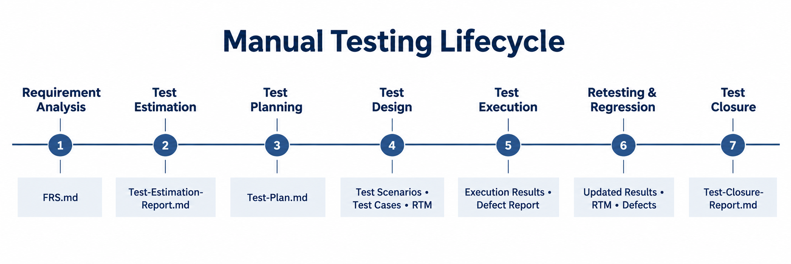

# Coffee Kiosk POS - Manual Testing Project

## Table of Contents

- [Project Overview](#project-overview)
- [Manual Testing Lifecycle](#manual-testing-lifecycle)
- [Documents in Testing Order](#documents-in-testing-order)
- [Traceability Flow](#traceability-flow)
- [Project Structure](#project-structure)

## Project Overview

This project demonstrates the manual testing lifecycle for the **Coffee Kiosk POS customer frontend**. The tested journey covers menu browsing, cart management, checkout, coupons, UPI/Card payments, receipts, session handling, usability, privacy, and reliability.

The repository contains the main STLC documents from requirement analysis through test closure. It is designed as a concise portfolio project for demonstrating requirement understanding, test design, traceability, execution, and defect reporting.

## Manual Testing Lifecycle



| Phase | Main activity | Associated document or output |
|---:|---|---|
| 1 | Requirement Analysis | [FRS.md](FRS.md) |
| 2 | Test Estimation | [Test-Estimation-Report.md](Test-Estimation-Report.md) |
| 3 | Test Planning | [Test-Plan.md](Test-Plan.md) |
| 4 | Test Design | Test Scenarios, Test Cases, and RTM in [coffee-kiosk-tests.xlsm](coffee-kiosk-tests.xlsm) |
| 5 | Test Execution | Execution results in `coffee-kiosk-tests.xlsm` and defects in [defect-report.xlsm](defect-report.xlsm) |
| 6 | Retesting and Regression | Updated test results, RTM status, and defect status |
| 7 | Test Closure | [Test-Closure-Report.md](Test-Closure-Report.md) |

## Documents in Testing Order

### 1. Functional Requirements Specification

[FRS.md](FRS.md) defines the customer-facing scope and the expected system behaviour. It contains functional and non-functional requirement IDs that provide the baseline for all later testing documents.

### 2. Test Estimation Report

[Test-Estimation-Report.md](Test-Estimation-Report.md) estimates the manual QA effort using a Work Breakdown Structure. It records scope, assumptions, dependencies, resources, risks, estimated hours, and the proposed schedule.

### 3. Test Plan

[Test-Plan.md](Test-Plan.md) explains how testing will be performed. It defines objectives, in-scope and out-of-scope areas, test approach, environment, responsibilities, schedule, entry and exit criteria, defect handling, risks, and deliverables.

### 4. Test Scenarios, Test Cases, and RTM

[coffee-kiosk-tests.xlsm](coffee-kiosk-tests.xlsm) contains:

- High-level test scenarios for each feature.
- Feature-wise test cases with steps, test data, expected results, actual results, priorities, and execution status.
- A Requirements Traceability Matrix mapping every FRS requirement to its scenario, test case, WBS activity, execution status, and related defect.

### 5. Defect Report

[defect-report.xlsm](defect-report.xlsm) records the defects identified during execution. Each defect includes its requirement and test-case reference, reproduction steps, expected and actual results, severity, priority, owner, and current status.

### 6. Retesting and Regression Results

After fixes are delivered, failed cases are re-executed and affected customer flows are regression-tested. The final results are reflected in the test-case sheets, RTM, and defect report rather than maintained as a separate document.

### 7. Test Closure Report

[Test-Closure-Report.md](Test-Closure-Report.md) summarizes execution, requirement coverage, defects, metrics, risks, exit-criteria status, lessons learned, and the final QA release recommendation.

## Traceability Flow

`FRS Requirement → Test Scenario → Test Case → Execution Result → Defect → Retest → Closure`

This chain makes it possible to confirm that every requirement is tested and that every failed test can be traced to a reported defect and final disposition.

## Project Structure

```text
coffee-kiosk-manual-testing/
├── README.md
├── FRS.md
├── Test-Estimation-Report.md
├── Test-Plan.md
├── coffee-kiosk-tests.xlsm
├── defect-report.xlsm
├── Test-Closure-Report.md
├── assets/
│   ├── manual-testing-lifecycle.png
│   └── customer-frontend mockups
└── pdfs/
    └── PDF versions of the Markdown documents
```

**Author:** Kushagra Sinha  
**Project:** Coffee Kiosk POS - Customer Frontend
